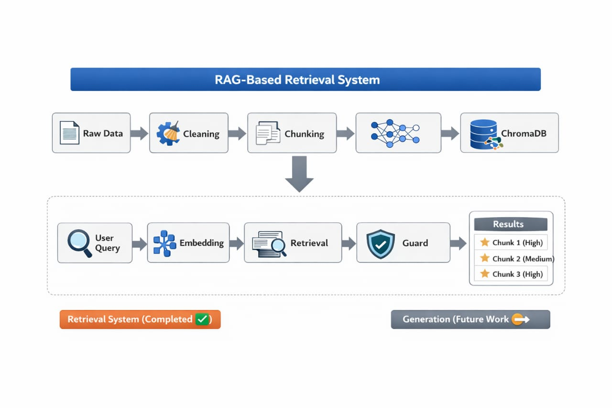

# AI RAG System

---

## Overview

This project implements a Retrieval-Augmented Generation (RAG) pipeline using Python documentation as the knowledge base.

It transforms raw text into embeddings, stores them in a vector database, and retrieves the most relevant chunks based on semantic similarity.

### Built to simulate a semantic search engine with confidence-based filtering for better accuracy.

---

## Run on Colab

[]
(https://colab.research.google.com/github/NidhiKamal05/AI-RAG-System/blob/main/path/to/notebook.ipynb)

---

## Architecture

	
	 
	<em>End-to-End RAG Pipeline Architecture</em>
	 
	Diagram generated using ChatGPT (OpenAI)

---

## Tech Stack

- Python

- Transformers (AutoTokenizer)

- Sentence Transformers (all-MiniLM-L6-v2)

- ChromaDB (Vector Database)

- Google Colab

- Google Drive

---

## Google Colab + Drive Integration

This project is implemented and tested entirely on Google Colab with dataset stored in Google Drive.

### Setup

from google.colab import drive
drive.mount('/content/drive')

DATA_PATH = "/content/drive/MyDrive/your_project_folder/"

- Enables seamless file access and persistence

---

## Project Workflow

### Data Cleaning

- Removed \r

- Split using \n

- Stripped whitespace

- Rejoined cleaned text

---

### Chunking

- Implemented token-based chunking with overlap (fixed size strategy)

- Tokenizer: TinyLlama (via Transformers)

- Chunk size: 400 tokens

- Overlap: 50 tokens

---

### Embeddings

- Model: all-MiniLM-L6-v2 (via Sentence Transformers)

- Converts text → vectors

- Normalized for cosine similarity

---

### Data Ingestion

- Reads files from Google Drive

- Applies:

	- Cleaning

	- Chunking

	- Embedding

- Stores:

	- Text

	- Embeddings

	- Metadata

---

### Retrieval

- Database: ChromaDB

- Metric: Cosine Similarity

- Top K: 3

- Process:

	- Query → embedding

	- Similarity search

	- Return top chunks

---

### Guard System (Key Feature 🔥)

- Improves reliability using confidence scoring

1. Logic:

	- Compare top 2 similarity scores

	- Compute difference (gap)

2. Confidence Levels:

	- High score: > 0.42
	- Medium score: = 0.42 AND gap ≥ 0.01
	- Low Ignored

→ Filters irrelevant results
→ Ensures better precision

---

### Pipeline

Query → Embedding → Retrieval → Guard → Guard Output

---

## Project Structure

AI-RAG-System/
- data/
	- text/
        - (Python tutorial files)

- db/
    - chroma_db/
        - (stored embeddings collection)

- ingestion/
	- __init__.py
	- chunk.py
	- ingestion.py

- models/
	- __init__.py
	- embedding_model.py

- pipeline/
	- __init__.py
	- pipeline.py

- rag/
	- __init__.py
	- guard.py
	- retriever.py

- settings/
	- __init__.py
	- config.py

- notebook.ipynb

---

### Structure Explanation

- data/ → Contains raw dataset (Python documentation)

- db/ → Stores vector database (ChromaDB embeddings)

- ingestion/ → Handles cleaning, chunking, and data ingestion

- models/ → Embedding model logic

- pipeline/ → End-to-end RAG pipeline

- rag/ → Core retrieval + guard logic

- settings/ → Configuration (thresholds, paths, etc.)

- notebook.ipynb → Colab notebook for running and testing

---

## Features

- End-to-end RAG pipeline

- Semantic search system

- Token-based chunking with overlap

- Confidence-based filtering (Guard)

- Modular architecture

- Google Colab + Drive integration

---

## Experimentation

- Tested with multiple queries

→ Tuned:

	- Similarity Threshold = 0.42

	- Gap = 0.01

---

## Use Cases

- Query Python documentation intelligently

- Semantic search engine

- Base for chatbot systems

---

## Future Improvements

- Context building and prompt generation

- Add LLM for answer generation

- Build UI

- Hybrid search

- Implement semantic chunking

- Improve ranking mechanism

---

## Author

Nidhi Kamal

---

## Support

If you found this project helpful: 
⭐ Star this repository 
🔗 Share it on LinkedIn 

---
